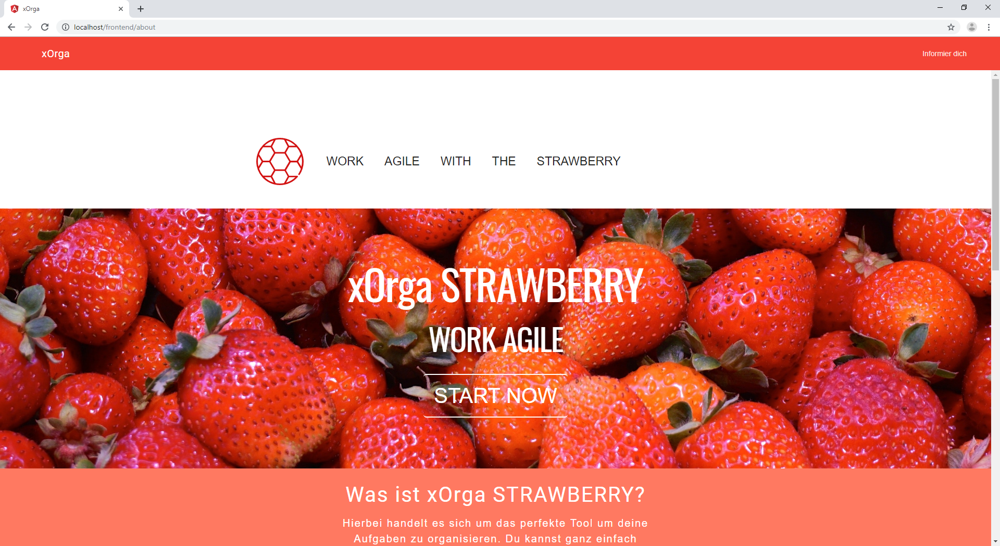
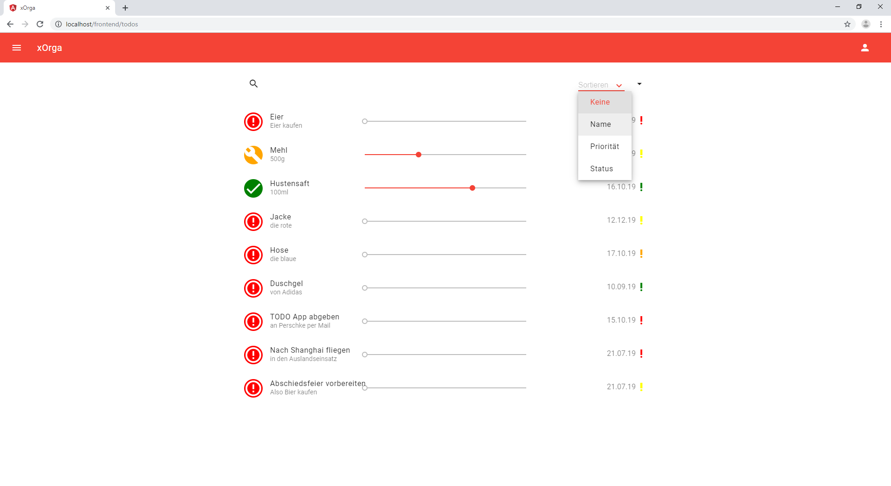

<h1>dhbw-vs-todo</h1>

by Marvin Rothmann  :smile:, Sebastian Heckl  :grinning: and Simon Eßlinger   :smiley:

---

A responsive Angular SPA web app based on a RESTful Slim PHP backend to organize your TODOs. Implemented as part of the lecture "Web-DB-Kopplung" in the fourth semester business informatics at the DHBW-VS.

## :mag: About the assignment

[The complete assignment](./docs/requirements/Anforderungskatalog.pdf). TL;DR:

> Create a web application to manage task lists (ToDo-Lists). [...] The implementation has to be in the form of a single page application (SPA) and be based on a current XAMPP installation under Windows 10 that can be run without further adjustments. For the implementation only a selection of libraries and frameworks are allowed. In case of doubt, please ask!

## :blush: Screenshots

## :page_facing_up: License

See `LICENSE` file.
