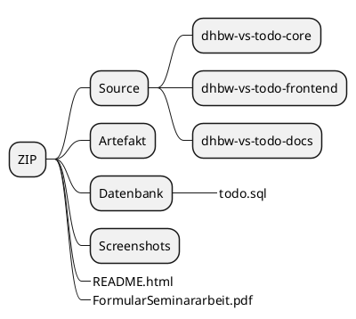
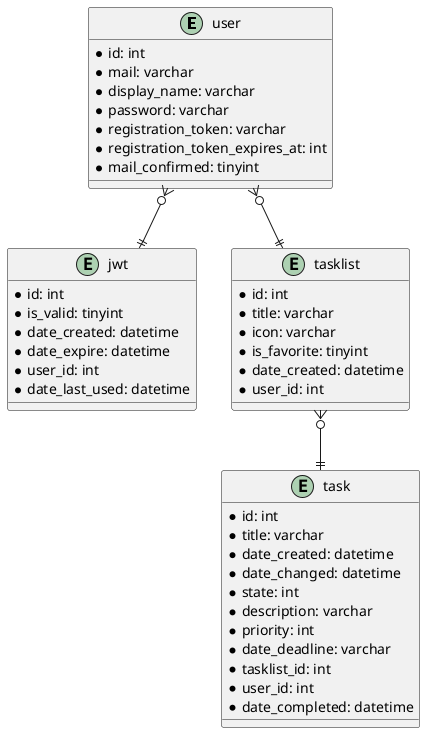
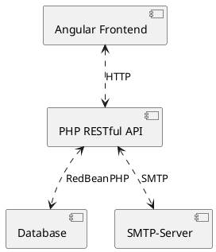
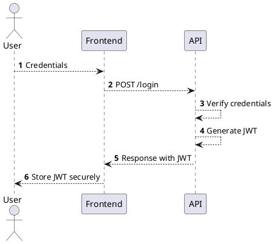

# Seminararbeit: Web-DB-Kopplung <!-- omit in toc -->

<!-- markdownlint-disable MD004 -->

Marvin Rothmann  :smile:, Sebastian Heckl  :grinning:, Simon Eßlinger   :smiley:
  
## Inhaltsverzeichnis <!-- omit in toc -->

- [Übersicht über die Dateien in der ZIP](#%C3%9Cbersicht-%C3%BCber-die-Dateien-in-der-ZIP)
- [Setup](#Setup)
  - [Troubleshooting](#Troubleshooting)
- [Entity-Relationship-Diagramm](#Entity-Relationship-Diagramm)
- [Highlights](#Highlights)
  - [Architektur Highlights](#Architektur-Highlights)
  - [Frontend Highlights](#Frontend-Highlights)
  - [Backend Highlights](#Backend-Highlights)
  - [Entwickler-Experience](#Entwickler-Experience)
  - [Dokumentation in Markdown](#Dokumentation-in-Markdown)
- [Mögliche Verbesserungen](#M%C3%B6gliche-Verbesserungen)
  - [Architekturverbesserungen](#Architekturverbesserungen)
  - [Frontend Verbesserungen](#Frontend-Verbesserungen)
  - [Backend Verbesserungen](#Backend-Verbesserungen)
  - [DevOps / SRE Verbesserungen](#DevOps--SRE-Verbesserungen)

## Übersicht über die Dateien in der ZIP

* Im Ordner `Source` befindet sich unsere git-Repositories, wie sie bei uns in [Azure DevOps Repos](https://azure.microsoft.com/en-in/services/devops/) eingecheckt sind.
* Im Ordner `Artefakt` befindet sich unsere direkt komplett lauffähige App.
* Im Ordner `Datenbank` befindet sich ein Datenbank-Dump unserer App.
* Im Ordner `Screenshots` wird das Frontend unserer App vorgestellt.

## Setup

1. Dump der Datenbank mit `utf8_general_ci` aus `./Datenbank/todo.sql` importieren.
2. Inhalt des Ordners `./Artefakt/` in das Public HTML Verzeichnis des [Apache](https://httpd.apache.org/)-Servers kopieren, sodass im `htdocs`-Ordner dann die Ordner `core` und `frontend` zu finden sind.

> Wir benutzen im Core einen externen SMTP-Server über Port `587` um Emails zu verschicken. Der externe Server versendet Mails mit der zufällig ausgewählten (weil kostenlos) Email-Adresse `maebelle.emilygrace@buycow.org`.

### Troubleshooting

Sollte es vorkommen, dass etwas nicht out-of-the-box funktioniert haben Sie folgende Möglichkeiten Anpassungen vorzunehmen:

* Falls Sie die Konfiguration des Backends ändern wollen (Datenbank, SMTP-Server, JWT-Auth...) bearbeiten Sie die Datei `./Artefakt/core/src/settings.php`.
* Falls Sie die Konfiguration des Frontends ändern wollen (Backend-URL) bearbeiten Sie die Datei `./Artefakt/frontend/assets/config.json`.

## Entity-Relationship-Diagramm

> Automatisch generiert von RedBeanPHP und grafisch dargestellt mit [PlantUML](http://plantuml.com/) (in [Krähenfuß-Notation](https://de.wikipedia.org/wiki/Martin-Notation)).

## Highlights

### Architektur Highlights

* SPA Frontend mit [Angular](https://angular.io/) als Framework.
* RESTful API mit [PHP](https://php.net/) und [Slim](http://www.slimframework.com/).
* MySQL, MariaDB, PostgreSQL, SQLite, CUBRID oder Firebird/Interbase als Datenbank, integriert durch [RedBeanPHP](https://redbeanphp.com/index.php).
* Ein beliebiger SMTP Server, integriert durch [PHPMailer](https://github.com/PHPMailer/PHPMailer).

Frontend und Backend sind nur lose über die RESTful API gekoppelt. So konnten wir die beiden Komponenten auch getrennt voneinander entwickeln. Auch ist es so möglich, dass enthusiastische Nutzer unserer App sich mit Hilfe unserer Dokumentation einen eigenen Client in einer beliebigen Sprache entwickeln können.

### Frontend Highlights

#### Allgemein <!-- omit in toc -->

Jeder Zustand des Frontends wird in der URL abgebildet. So kann man sich Links für z.B. speziell gefilterte Aufgaben-Abfragen speichern und später wieder die selbe Ansicht aufrufen.

#### Dashboard <!-- omit in toc -->

Jede Info kann angeklickt werden um direkt zu den Aufgaben zu kommen (:warning: siehe [Frontend-Verbesserungen](#Frontend-Verbesserungen)).

#### Aufgabenlisten-Übersicht <!-- omit in toc -->

* Rechtsklick auf eine Aufgabenliste um diese zu bearbeiten, zu löschen oder eine Übersicht zu öffnen (:warning: siehe [Frontend-Verbesserungen](#Frontend-Verbesserungen)).
* Mit einem Klick auf den Stern kann eine Aufgabenliste favorisiert werden und wird dann samt Anzahl aller offenen Aufgaben im Menü angezeigt.
* Mit einem Klick auf das Icon links kann das Icon geändert werden.
* Über das `+`-Symbol können Aufgabenlisten hinzugefügt werden, wobei diese gleich automatisch im Backend gespeichert werden.

#### Aufgabenliste <!-- omit in toc -->

* Der Status einer Aufgabenliste wird über einen Slider festgelegt (Aktiv, Fertig...)
  * Mobile wird der Slider aus Platzgründen zu einen Menü.
* Über das `+`-Symbol können Aufgaben hinzugefügt werden. In diesem Dialog erscheint ein `Speichern`-Button zum speichern und das `+`-Symbol wird zu einem `x`-Symbol um abzubrechen.
  
### Backend Highlights

#### Authentifizierung nach [RFC7519](https://tools.ietf.org/html/rfc7519) <!-- omit in toc -->

[JWT](https://jwt.io/introduction/) (JSON Web Token) sind zustandslos. Daher gibt es keine komplizierte Sessionverwaltung und im HTML5-Storage des Frontends muss kein Passwort für das Backend gespeichert werden.

> JWTs sind wie Passwörter zu behandeln, haben jedoch den Vorteil, dass sie invalidiert werden können.

##### Grober Gesamt-Ablauf <!-- omit in toc -->

* User registriert sich.
* User muss Email bestätigen.
* User kann sich jetzt mit Mail und Passwort einloggen.
* User erhält einen JWT.
  * JWT hat ein Ablaufdatum.
  * JWT hat eine Signatur.
  * JWT hat ein Scope (= Berechtigung).
* User muss bei jeder Request an eine geschützte Route einen gültigen JWT mitschicken.
* Backend überprüft dann, ob das Scope des JWT ausreichend für die Route ist.

##### Ausschnitt: Login-Vorgang <!-- omit in toc -->

##### Szenario: Kompromitiertes JWT <!-- omit in toc -->

* Angreifer klaut JWT eines Users.
* Angreifer hat zunächst Vollzugriff auf alle Routen, die im Scope des Token definiert sind.
* Der Angreifer kann Email / Passwort mit dem JWT aber nicht ändern.
* User kann sich weiter einloggen.
* User invalidiert das gestohlene JWT, wobei er sich erneut mit Email und Passwort authentifiziert.
* Angreifer ist ausgesperrt und kein Passwort wurde bekannt.

### Entwickler-Experience

Um auf verschiedenen Rechnern und Betriebssystemen schnell entwickeln zu können und immer die gleiche gewohnte Entwicklungsumgebung zu haben, haben wir für das Frontend und Backend Entwicklungsumgebungen über [Docker-Compose](https://docs.docker.com/compose/)-Dateien definiert.

> Im Backend wird z.B., wenn die `docker-compose.yaml`-Datei des Backends mit Docker ausgeführt wird automatisch eine [MariaDB](https://mariadb.org/), [Adminer](https://www.adminer.org/) (ähnlich wie [phpMyAdmin](https://www.phpmyadmin.net/)) und ein [Apache](https://httpd.apache.org/)-Webserver in [Docker](https://www.docker.com/)-Containern gestartet und der Quellcode des Backends wird an die richtige Stelle im [Apache](https://httpd.apache.org/)-Container gemountet.

Außerdem wird im Backend ein [Insomnia](https://insomnia.rest/)-Workspace (`./Source/dhbw-vs-todo-core/insomnia.yaml`) gepflegt, mit welchem man bequem alle Routen des Backends testen kann.

#### CI / CD mit Azure DevOps <!-- omit in toc -->

Zur Quellcode-Verwaltung benutzen wir [git](https://git-scm.com/) in [Azure DevOps](https://azure.microsoft.com/en-in/services/devops/) nach dem [Gitflow Workflow](https://www.atlassian.com/git/tutorials/comparing-workflows/gitflow-workflow).

In unseren Repositories sind Branch-Policies aktiv, welche verhindern, dass ein Commit in die `develop` oder `master` Branch gerät, ohne dass ein anderer Entwickler drübergeschaut hat. Auch wird durch CI-Validation-Builds verhindert, dass  syntaktisch falsche Commits eingecheckt werden.

Zusätzlich wird bei jedem Commit auf `develop` oder `master` unsere App automatisch in die [Azure](https://azure.microsoft.com/en-us/)-Cloud deployed.

Falls Ressourcen in [Azure](https://azure.microsoft.com/en-us/) (WebApp, Datenbank...) fehlen sollten oder eine neue Umgebung (Neben `dev` z.B. `prod`) hochgefahren werden soll muss lediglich das Deployment-Skript der jeweiligen Komponente (`deploy.ps1`) ausgeführt werden.

So kann man auf einem neuen Rechner innerhalb von **10 Minuten**:

* Unsere Repositories aus Azure DevOps Repos klonen.
* Die Entwicklungsumgebung mit Docker hochfahren.
* Lokal eine Änderung am Quellcode machen.
* Eine neue Umgebung (z.B. `test`) in Azure hochfahren.
* Unsere Anwendung in die neue Umgebung deployen.

### Dokumentation in Markdown

Unsere Dokumentation ist in Markdown geschrieben und kann so einfach mit git verwaltet werden und mit Tools, wie z.B. [Docusaurus](https://docusaurus.io/) schnell & hübsch veröffentlicht werden.

#### Tooling für Markdown-Dokumentation <!-- omit in toc -->

Falls Sie sich unsere Dokumentation von z.B. unserer API (`./Source/dhbw-vs-todo-docs/architecture/API.md`) gerendert anschauen wollen benötigen Sie folgendes Tooling:

* [Visual Studio Code](https://code.visualstudio.com/)
* [Markdown All in One](https://marketplace.visualstudio.com/items?itemName=yzhang.markdown-all-in-one)
* [Markdown Preview Enhanced](https://marketplace.visualstudio.com/items?itemName=shd101wyy.markdown-preview-enhanced)
* [markdownlint](https://marketplace.visualstudio.com/items?itemName=DavidAnson.vscode-markdownlint)
* [PlantUML](https://marketplace.visualstudio.com/items?itemName=jebbs.plantuml)
* [Code Spell Checker](https://marketplace.visualstudio.com/items?itemName=streetsidesoftware.code-spell-checker)
* [German - Code Spell Checker](https://marketplace.visualstudio.com/items?itemName=streetsidesoftware.code-spell-checker-german)

## Mögliche Verbesserungen

### Architekturverbesserungen

* Filtering und Sorting der API verbessern durch Implementierung von z.B. [OData](https://www.odata.org/).
* Externen SMTP Server durch einen REST-Service ablösen (SMTP Port ist öfter gesperrt als der HTTP/HTTPS-Port).

### Frontend Verbesserungen

#### Verbesserung 1 <!-- omit in toc -->

**Problem**:

Alle Material-Selects mit Icon zeigen nach der Auswahl den Icon-Text an.

**Mögliche Lösung**:

Die Material-Select-Komponente überarbeiten, sodass ein Icon angegeben werden kann.

#### Verbesserung 2 <!-- omit in toc -->

**Problem**:

Accounts können noch nicht bearbeitet werden (E-Mail/Passwort ändern und Account löschen).

**Mögliche Lösung**:

Frontend und Backend weiterentwickeln.

#### Verbesserung 3 <!-- omit in toc -->

**Problem**:

Im Dashboard kann man noch nicht auf alle Infos klicken um zu einer Aufgabenübersicht zu kommen.

**Mögliche Lösung**:

Im Backend Routen anlegen, welche genau die geklickte Aufgabenlisten liefern im richtigen Zeitraum (z.B. alle erledigten Aufgaben der letzten 3 Tage), also erweitertes Filtering und Sorting im Backend.

#### Verbesserung 4 <!-- omit in toc -->

**Problem**:

Öffnet man in `Alle Aufgabenlisten` das Kontextmenü und macht dann einen Rechtsklick auf eine leere Fläche, bleibt das Menü offen. Zusätzlich öffnet sich das Standard-Kontextmenü.

**Mögliche Lösung**:

Rechtsklick ins Leere erfassen und das Menü schließen.

### Backend Verbesserungen

* Unit-Tests hinzufügen, damit man sich sicherer beim Releasen fühlen kann und die Code-Qualität ansteigt.
* MVC-Pattern sauberer durchziehen.
* Weitere Features hinzufügen. Vgl. [Google Keep](https://keep.google.com/), [Trello](https://trello.com/)...
  * E-Mail-Adresse ändern
  * Passwort ändern
  * Passwort-vergessen-Funktion
  * Account löschen
* Backend in einer schöneren Sprache als PHP schreiben. :P

### DevOps / SRE Verbesserungen

* [Azure Release Pipeline für die Infrastruktur der App](https://www.azuredevopslabs.com/labs/vstsextend/terraform/) hinzufügen.
* Integration-Tests hinzufügen.
* Deployment-Tests (Smoke-Tests) hinzufügen.
* Konfiguration vom Quellcode entfernen und [über Umgebungsvariablen regeln](https://www.12factor.net/config) (Über einen [Azure-Keyvault](https://azure.microsoft.com/en-in/services/key-vault/) bzw. Build-Variables).
* Builds in Azure Pipeline auf [YAML-Builds](https://docs.microsoft.com/en-us/azure/devops/pipelines/yaml-schema?view=azure-devops&tabs=schema) umstellen, damit sie mit im Quellcode dokumentiert sind.
* [VS Code DevContainer](https://code.visualstudio.com/docs/remote/containers) einrichten, damit man die Entwicklungsumgebung noch automatischer hochfahren kann.
* Den Builds License und Security Scans hinzufügen (mit z.B. [snyk](https://snyk.io/)).
