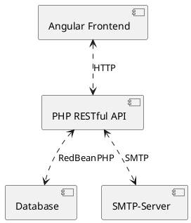
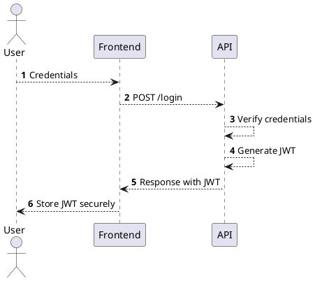

# Highlights

## Architektur

* Frontend und Backend sind komplett unabhängig voneinander
  * User könnten sich ihr eigenes Frontend bauen mit der Dokumentation zur API
  * marvin hat das frontend komplett unabhängig nur mit der doku und dem backend von simon entwickelt.
* RedBeanPHP als ORM
  * Nicht an MySQL Datenbank gebunden: Redbean unterstützt: MySQL, MariaDB, PostgreSQL, SQLite, CUBRID and Firebird/Interbase
  * NoSQL-Experience als Dev
* SMTP Server
  * Zum Versenden von Emails bei der Registrierung etc.
* PHP mit Slim als Framework

## Dev-Experience mit Docker und Insomnia

Um auf verschiedenen Rechnern und Betriebssystemen entwicklen zu können haben wir für das Frontend und Backend Entwicklungsumgebungen über docker-compose definiert. Beispiel backend:

Wenn die docker-compose-Datei des Backends mit Docker ausgeführt wird wird automatisch eine Datenbank, Adminer (ähnlich wie phpMyAdmin) und ein Apache-Webserver in Docker-Containern gestartet und der Quellcode des backends wird an die richtige Stelle im Apache-Container gemountet.

So kann man auf einem neuen Rechner innerhalb von 2 Minuten anfangen zu entwicklen und zu testen ohne das etwas (außer Docker) installiert werden muss.

Außerdem wird im Backend ein [Insomnia](https://insomnia.rest/)-Workspace (`insomnia.yaml`) gepflegt, mit dem man bequem alle Routen des Backends testen kann.

## CI / CD mit Azure DevOps

* Wir benutzen [git](https://git-scm.com/) für die Quellcode-Verwaltung und arbeiten mit dem [Gitflow Workflow](https://www.atlassian.com/git/tutorials/comparing-workflows/gitflow-workflow)
  * branches:
    * master => für Releases
    * develop => für den akteullen internen Entwicklungsstand
  * branch-policies:
    * keine direkten commits auf beiden branches => dafür feature/hotfix branches
    * nur commits per pull request
      * Damit ein PR durchgeht muss der Validation-Build durchlaufen und ein dritter den PR approven
* Unsere Repositories liegen in einer privaten Azure DevOps Organisation
  * dhbw-vs-todo-core => PHP RESTful API
  * dhbw-vs-todo-frontend => Angular Frontend
  * dhbw-vs-todo-docs => Dokumentation

### Contineous Integration

* Man entickelt in kleinen schritten in feature branches
* Man mergt, wenn man fertig ist via pr in develop
* bei einem commit via pr auf develop/master wird automatisch ein build ausgelöst, der dependencies installiert, testet und ein lauffähiges artefakt der app produziert und in Azure Devops Artifacts ablegt

### Contineous Deployment

* wenn ein neues artefakt von einem build von der develop branch vorliegt wird der code automatisch in unsere dev-Umgebung die Azure-Cloud deployed
  * bei einem build von master wird automatisch in die prod-Umgebung deployed
* wenn die Azure-Resourcen nicht erstellt sind können über die `deploy.ps1` in den jeweiligen repos die Resourcen automatisch angelegt werden

Unterm Strich kann ein lokaler code-change in unter 10 Minuten voll-automatisch in eine beliebige Azure-Umgebung deployed werden.

## Authentifizierung nach RFC7519

Auth nach [RFC7519](https://tools.ietf.org/html/rfc7519)

* JWT sind zustandslos => Keine serverseitige Session-Verwaltung

### Flow

* User registriert sich
* User muss Email bestätigen
* User kann sich jetzt mit Mail und Passwort einloggen
* User erhält einen JWT
  * JWT hat ein Ablaufdatum
  * JWT hat eine Signatur
  * JWT hat ein Scope (= Berechtigung)
* User muss bei jeder Request an eine geschützte Route einen gültigen JWT mitschicken

#### Szenario: Angreifer klaut sich einen JWT

* Angreifer klaut JWT eines Users
* Angreifer hat zunächst Vollzugriff auf alle Routen, die im Scope des Token definiert sind
* Der Angreifer kann Email / Passwort mit dem JWT aber nicht ändern.
* User kann sich weiter einloggen
* User invalidiert das gestohlene JWT, wobei er sich erneut mit Email + Passwort authentifiziert => Angreifer ist ausgesperrt

## Dokumentation mit Markdown

Unsere Dokumentation ist in Markdown geschrieben und kann so einfach mit git verwaltet werden und mit Tools, wie z.B. [Docusaurus](https://docusaurus.io/) schnell & hübsch veröffentlicht werden.